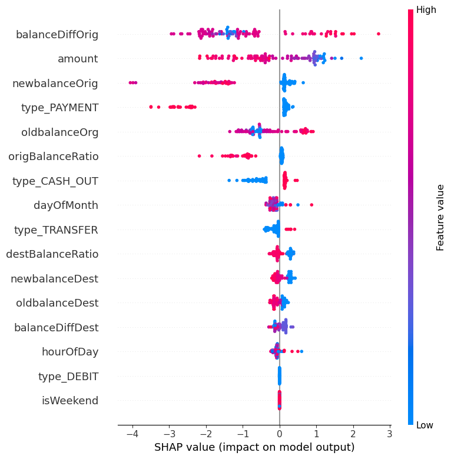

# 🛡️ Online Transaction Fraud Detection System

This project is a machine learning pipeline designed to detect fraudulent online financial transactions using real-world-like synthetic data. It leverages supervised learning models and model explainability tools to build a robust fraud detection system.

## 📂 Project Structure

```

fraud-detection/
├── data/                  # Raw and preprocessed data
├── notebooks/             # Jupyter notebooks for EDA, training, tuning, SHAP analysis
├── outputs/               # Plots, metrics reports, etc.
├── requirements.txt       # Python dependencies
└── README.md              # Project documentation

````

## 📊 Dataset

The dataset contains the following features:

- `step`: Time unit (1 step = 1 hour)
- `type`: Type of transaction (TRANSFER, CASH_OUT, etc.)
- `amount`: Transaction amount
- `nameOrig` / `nameDest`: Originator / recipient
- `oldbalanceOrg` / `newbalanceOrig`: Sender’s balance before/after
- `oldbalanceDest` / `newbalanceDest`: Receiver’s balance before/after
- `isFraud`: 1 if the transaction is fraudulent, 0 otherwise

Additional engineered features include:
- `balanceDiffOrig`, `balanceDiffDest`
- `orig_balance_ratio`, `dest_balance_ratio`
- One-hot encoded `type_*`

## ⚙️ How It Works

1. **Data Preprocessing**  
   - Handled missing values, created balance ratios, and encoded categorical variables.
   - Resampled data using techniques like SMOTE due to class imbalance.

2. **Model Training**  
   - Trained using models such as:
     - Random Forest
     - XGBoost (best performance)
   - Evaluated with metrics like Precision, Recall, F1, ROC-AUC.

3. **Cross-Validation & Hyperparameter Tuning**  
   - Used `RandomizedSearchCV` for tuning
   - Cross-validation confirmed model robustness

4. **Model Explainability (SHAP)**  
   - Global: SHAP summary plot shows most impactful features
   - Local: (Optional) Force plots and waterfall plots for individual transactions

## ✅ Results

- Best ROC-AUC Score: **0.983**
- Precision (fraud): **0.65–0.83**
- Recall (fraud): **0.71–0.79**
- Accuracy: ~**100%**, but with caution due to class imbalance

## 🧠 Key Learnings

- Fraud detection is highly imbalanced → evaluation must go beyond accuracy
- SHAP helps demystify how models make decisions
- Transaction type and balance changes are critical fraud indicators

## 🚀 Getting Started

### Requirements

Install dependencies with:

```bash
pip install -r requirements.txt
````

### Run Notebook

1. Launch Jupyter Notebook:

   ```bash
   jupyter notebook
   ```
2. Open `notebooks/preprocessing.ipynb` (or your main notebook)
3. Run cells step-by-step
4. Open `notebooks/models.ipynb`
5. Run cells step-by-step

## 🛠️ Future Improvements

* Deploy as a web API (e.g., using FastAPI or Flask)
* Monitor real-time transactions
* Incorporate temporal features like transaction history windows
* Use anomaly detection methods as unsupervised fallback

## 📸 Sample SHAP Plot



---

**Author**: Oladosu Larinde
**Contact**: [LinkedIn](https://www.linkedin.com/in/olarindeladosu) | [Email](mailto:larindeakin@gmail.com)

